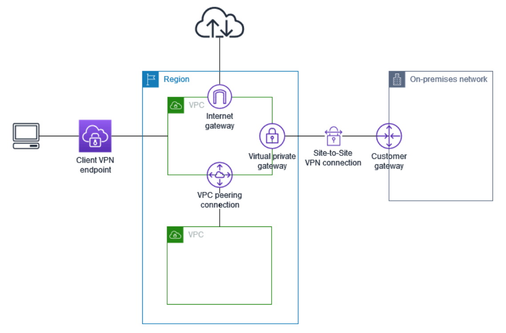
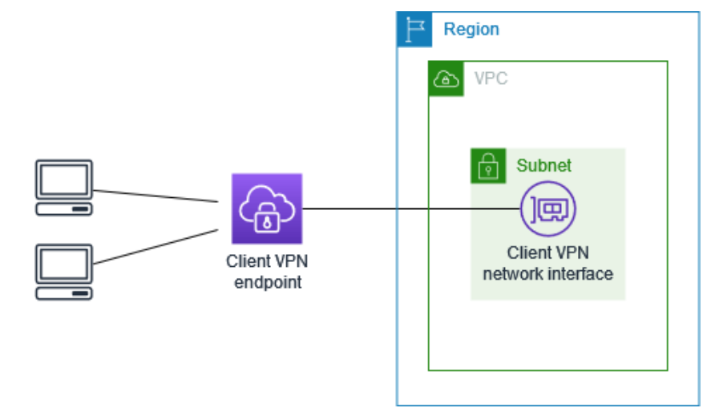
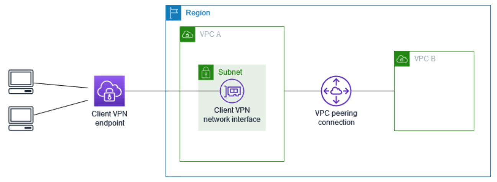
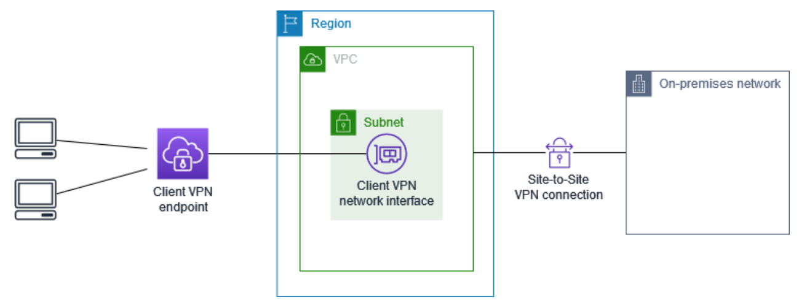
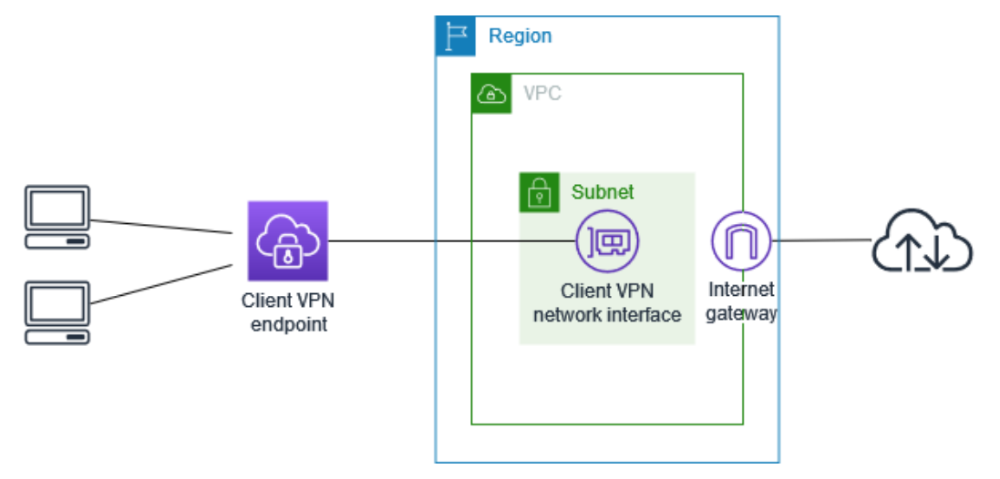
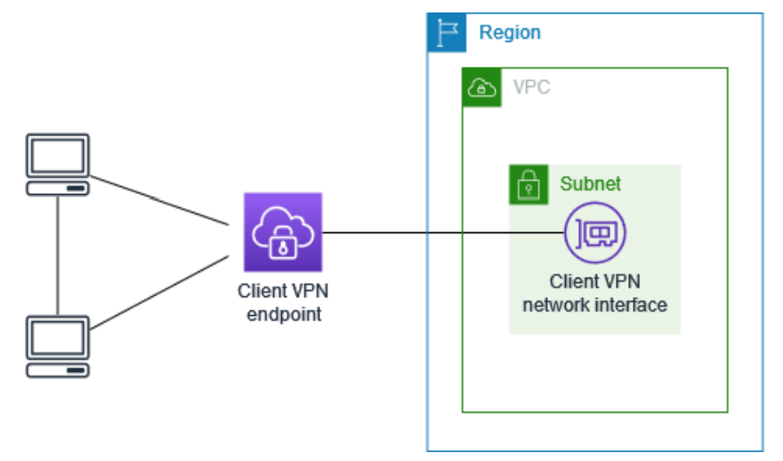
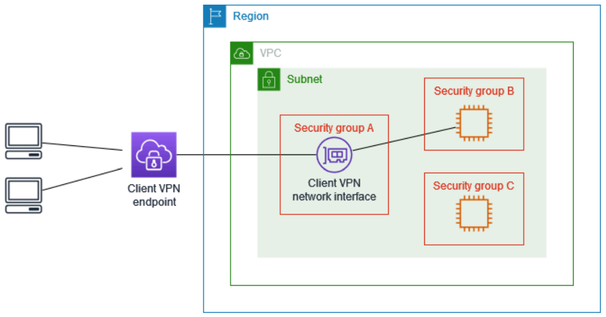

# AWS Client VPN Overview

## Introduction

AWS Client VPN is a fully managed VPN service designed for secure, remote access to AWS and on-premises resources. With AWS Client VPN, users connect from anywhere through an OpenVPN-based client, making it a flexible and scalable option for organizations needing secure remote connections. AWS handles all backend management, so users can focus on securely connecting their infrastructure.

---

## Key Features of AWS Client VPN

AWS Client VPN offers a variety of features that improve security, usability, and manageability:

- **Secure Connections**: Connections are TLS-encrypted using the OpenVPN client, providing secure access to your resources.
- **AWS Managed**: As a managed service, AWS Client VPN simplifies operations, removing the need to deploy and manage third-party VPNs.
- **Elastic Scalability**: The service automatically scales based on user connections, providing a seamless experience without needing manual adjustments.
- **Multiple Authentication Options**: AWS Client VPN supports Active Directory-based authentication, federated authentication (SAML), and certificate-based authentication, allowing flexible integration with existing systems.
- **Custom Access Control**: You can define network-based rules by user group and manage access at the Active Directory group level or through security groups.
- **Unified Access**: Users gain access to both AWS and on-premises resources over a single VPN connection, simplifying remote access.
- **Comprehensive Monitoring**: The service allows you to monitor connection attempts and manage active connections, as well as terminate sessions if needed.
- **Integration with AWS Services**: Deep integration with AWS services like AWS Directory Service and Amazon VPC allows smooth incorporation into existing AWS environments.

---

## Components of AWS Client VPN

### 1. **Client VPN Endpoint**
The Client VPN endpoint serves as the termination point for client VPN sessions. Administrators set up the endpoint and provide configuration files to users who connect to it. Once connected, users can securely access designated AWS and on-premises resources.

### 2. **Target Network**
The target network is the specific VPC subnet(s) linked to the Client VPN endpoint. This subnet enables users to connect to resources within the VPC. Associating multiple subnets in different Availability Zones enhances high availability for remote connections.

### 3. **Route**
Each Client VPN endpoint has a route table to define accessible network paths. For example, if a company has resources in different VPCs or AWS regions, the route table can include routes to those destinations, allowing users to navigate seamlessly.

### 4. **Authorization Rules**
Authorization rules control which users can access specific networks by integrating with Active Directory or an identity provider (IdP). For example, only users in the “Finance” Active Directory group may access specific financial applications on the network.

### 5. **Client**
The client is the end user connecting to the Client VPN endpoint. Users install an OpenVPN-compatible client application on their device and use a VPN configuration file to connect securely.

### 6. **Client CIDR Range**
The client CIDR range assigns a unique IP address to each connection from the specified IP range, like `10.2.0.0/16`. This range defines the IP addresses for all connected clients.

### 7. **Client VPN Ports**
AWS Client VPN supports ports **443** and **1194** for both TCP and UDP protocols. Typically, **443** is used for connections as it’s often open on firewalls, making it ideal for secure, consistent access.

### 8. **Client VPN Network Interfaces**
AWS Client VPN creates network interfaces in each associated subnet, which route VPN traffic to VPC resources. **Source Network Address Translation (SNAT)** converts client IP addresses from the client CIDR range into the IP address of the VPN network interface for internal routing.

### 9. **Connection Logging**
Enabling connection logging records details about client connections, allowing administrators to track activity, run security analysis, and troubleshoot connection issues.

### 10. **Self-service Portal**
AWS provides a self-service portal, a web page where end users can download the AWS VPN Desktop Client and the latest configuration file. The portal is globally available, so end users can quickly access the tools and configuration they need.

AWS Client VPN offers a powerful, scalable, and secure solution for organizations needing flexible remote access to cloud and on-premises resources. By handling the complexities of VPN management and scaling, AWS Client VPN enables administrators to focus on security and user access control. The deep integration with AWS services, coupled with robust authentication and authorization options, makes AWS Client VPN ideal for diverse, remote-work-friendly infrastructure.

For further exploration, check out the official [AWS Client VPN documentation](https://docs.aws.amazon.com/vpn/latest/clientvpn-admin/what-is.html).

---

# AWS Client VPN Pricing Overview

AWS Client VPN pricing is structured around endpoint associations, connection hours, data transfer, and optional features such as connection logging and client connect handlers. This document provides a breakdown of AWS Client VPN’s pricing model, including additional costs for integrated AWS services.

## Pricing Components

### 1. **Endpoint Associations and Connection Hours**
   - **Endpoint Association**: Each time a Client VPN endpoint is associated with a subnet, you incur an hourly charge.
   - **Connection Hours**: AWS charges for each active VPN connection per hour. This fee applies even if there is no data transfer, so the cost is based solely on connection time.
   - For up-to-date pricing details, visit [AWS Client VPN Pricing](https://aws.amazon.com/client-vpn/pricing/).

### 2. **Data Transfer Charges**
   - **Outbound Data Transfer**: Charges apply to data transferred out from AWS EC2 instances to the internet.
   - This cost applies only for data leaving the AWS network, as inbound data transfer is generally free.
   - For details on data transfer rates, see the [Amazon EC2 On-Demand Pricing page](https://aws.amazon.com/ec2/pricing/on-demand/).

### 3. **CloudWatch Connection Logging**
   - If connection logging is enabled, AWS Client VPN will log connection events to Amazon CloudWatch.
   - **CloudWatch Log Groups**: Enabling connection logging requires creating a CloudWatch Logs log group, which incurs charges based on data volume and retention.
   - Refer to [Amazon CloudWatch Pricing](https://aws.amazon.com/cloudwatch/pricing/) for details.

### 4. **Client Connect Handler with AWS Lambda**
   - **Lambda Integration**: AWS Client VPN can invoke a Lambda function as a client connect handler, enabling customized actions upon VPN connection.
   - **Lambda Invocation Charges**: You are billed for Lambda function invocation and execution duration.
   - Visit the [AWS Lambda Pricing](https://aws.amazon.com/lambda/pricing/) page for more information on Lambda costs.

### 5. **Elastic IP Addresses**
   - Each Client VPN endpoint association requires a VPC subnet, often connected to the internet through an Internet Gateway.
   - **Elastic IPs (EIPs)**: If Elastic IPs are allocated to the VPN’s network interfaces (ENIs) within a VPC with an Internet Gateway, they will incur additional charges as in-use public IPv4 addresses.
   - See [Elastic IP Pricing on the VPC Pricing Page](https://aws.amazon.com/vpc/pricing/) for details.

AWS Client VPN offers a flexible and scalable VPN solution for connecting remote users securely to AWS and on-premises resources. While the base pricing includes endpoint and connection hours, other charges—such as data transfer, connection logging, and EIP use—may apply based on specific configurations and integrations with additional AWS services.

For further information, check AWS’s comprehensive [Client VPN Pricing Guide](https://aws.amazon.com/client-vpn/pricing/).

---

# AWS Client VPN: Rules and Best Practices

This document outlines the essential rules and recommended best practices for configuring and using AWS Client VPN. Adhering to these guidelines ensures optimal performance, security, and reliability when connecting to AWS resources via Client VPN.

## Key Rules for AWS Client VPN Usage

1. **Bandwidth Considerations**
   - Each user connection supports a minimum of 10 Mbps bandwidth.
   - Maximum bandwidth per user depends on the number of active connections to the Client VPN endpoint.

2. **Client CIDR Range Configuration**
   - **No Overlaps**: The Client CIDR range should not overlap with the CIDR range of the associated VPC subnet or any additional routes in the VPN’s route table.
   - **Range Size**: Client CIDR blocks should have a size between `/12` and `/22`.
   - **IP Allocation**: Some IP addresses within the Client CIDR range are reserved for availability and cannot be assigned to clients. Choose a CIDR range with double the required IPs for expected connections.
   - **Immutable Configuration**: Once a Client VPN endpoint is created, the Client CIDR range cannot be modified.

3. **Subnet Association**
   - All subnets associated with a Client VPN endpoint must belong to the same VPC.
   - Only one subnet per Availability Zone can be associated with a Client VPN endpoint.
   - **Limitations**: Dedicated tenancy VPCs do not support Client VPN subnet associations.

4. **IPv4 Only**
   - AWS Client VPN supports IPv4 traffic exclusively. For IPv6 traffic, consult AWS documentation on IPv6 considerations.

5. **DNS Name Usage**
   - **Avoid IP-based Connections**: Due to dynamic IP resolution, always connect to the Client VPN endpoint using the DNS name rather than an IP address.

6. **Self-Service Portal Limitations**
   - The self-service portal is unavailable for clients using mutual authentication methods.

7. **IP Forwarding Restrictions**
   - IP forwarding is not supported by the AWS Client VPN desktop application, though it is supported on other OpenVPN clients.

8. **AWS Managed Microsoft AD Region Constraints**
   - Ensure that the Client VPN endpoint and the AWS Managed Microsoft AD are located within the same AWS Region.

9. **Multi-Factor Authentication (MFA)**
   - **Password Format Restriction**: If MFA is disabled, user passwords should avoid the format: `SCRV1:base64_encoded_string:base64_encoded_string`.

10. **Single User per Computer**
    - A VPN connection cannot be established from computers with multiple users logged in simultaneously.

## Security Recommendations

1. **Client LAN Address Ranges**
   - LAN IP address ranges on client devices should fall within the private IP address spaces: `10.0.0.0/8`, `172.16.0.0/12`, `192.168.0.0/16`, or `169.254.0.0/16`.
   - **Blocked Traffic**: If a client’s LAN falls outside of these ranges, the Client VPN endpoint will redirect LAN traffic to the VPN, mitigating the risk of local net attacks like TunnelCrack.

2. **Connection Integrity**
   - AWS Client VPN enforces that the IP connected by the client matches the IP resolved by the Client VPN endpoint’s DNS name. This requirement helps protect against IP-based attacks.

Following these rules and best practices for AWS Client VPN ensures robust and secure connections while maintaining compliance with AWS standards. Correctly configuring the Client VPN endpoint, client CIDR ranges, and subnet associations, along with adhering to the recommended security configurations, is essential to maximize performance and secure access to AWS resources.

For additional resources on setting up and configuring AWS Client VPN, please refer to the [AWS Client VPN Documentation](https://docs.aws.amazon.com/vpn/latest/clientvpn-admin/what-is.html).

---

## **How AWS Client VPN Works**

### **1. Administrator Role**

The **administrator** is responsible for the initial setup, configuration, and management of the VPN service. Below are the core responsibilities of the administrator:

- **Creating the Client VPN Endpoint:** Initiates the setup by establishing a VPN endpoint in AWS, which serves as the main access point for users.
  
- **Associating Target Network:** Connects the VPN endpoint to a subnet within the Virtual Private Cloud (VPC) where resources are accessible.

- **Configuring Authorization Rules:** Defines access control rules, specifying which users can access specific resources.

- **Setting Up Routes:** Additional routing configurations enable access to on-premises networks or other AWS regions if needed.

- **Distributing VPN Configuration:** Downloads and provides the **Client VPN configuration file** to users. This file contains the DNS name and necessary authentication details for clients to securely connect to the VPN.

> For a detailed setup guide, refer to [Get Started with AWS Client VPN](https://docs.aws.amazon.com/vpn/latest/clientvpn-admin/cvpn-getting-started.html).

### **2. Client Role**

The **client** is the end user who connects to the VPN endpoint to securely access the resources in AWS or on-premises networks:

- **Establishing a VPN Session:** Uses an OpenVPN-compatible client on their device, leveraging the VPN configuration file to establish a secure connection.

- **Accessing Resources:** Once connected, clients can securely interact with:
  - **AWS Resources:** Resources within the VPC subnet, such as EC2 instances, databases, or applications.
  - **On-premises Networks:** Access to on-premises resources is available when routing rules are configured.
  - **Other Clients or Services:** Clients may interact with additional resources based on the configured routes and permissions.

> For more details on connecting as a client, see [Getting Started in the AWS Client VPN User Guide](https://docs.aws.amazon.com/vpn/latest/clientvpn-user/client-vpn-user-guide.html).

---

# AWS Client VPN Scenarios and Examples

AWS Client VPN is a managed, client-based VPN service that enables secure access to AWS resources and on-premises networks. AWS Client VPN provides flexible configuration options for various network access needs. Below are some common scenarios and examples demonstrating how to configure Client VPN access for different use cases.

## Scenarios and Configuration Examples

### 1. Access a Single VPC using Client VPN
   - **Description**: Configures Client VPN access to a single target VPC.
   - **Use Case**: Ideal for secure access to resources within one specific VPC only.
   - **Configuration Example**:
      - **Target Network**: Single VPC
      - **Client Permissions**: Configured to access only the designated VPC resources.
      - **Access Control**: Use security groups or authorization rules for fine-grained access control within the VPC.
    

### 2. Access a Peered VPC using Client VPN
   - **Description**: Provides access to a primary VPC (VPC A) and any additional peered VPCs (such as VPC B).
   - **Use Case**: Suitable for scenarios where resources are distributed across multiple VPCs connected through VPC peering.
   - **Configuration Example**:
      - **Target Network**: Primary VPC (VPC A)
      - **Additional Access**: Access resources in peered VPCs (e.g., VPC B).
      - **Access Control**: Manage routes and configure authorization rules to allow access between the VPCs.

### 3. Access an On-Premises Network using Client VPN
   - **Description**: Configures Client VPN for access to resources within an on-premises network only.
   - **Use Case**: Ideal for accessing resources that are hosted on-premises and not within AWS.
   - **Configuration Example**:
      - **Target Network**: On-premises network
      - **VPN Connection**: Establish a Site-to-Site VPN connection between AWS and the on-premises network.
      - **Access Control**: Configure the Client VPN endpoint to forward traffic to the on-premises network.

### 4. Access the Internet using Client VPN
   - **Description**: Provides clients with access to both a VPC and the internet via the VPN connection.
   - **Use Case**: Suitable for environments where users need access to AWS resources and the internet from a secure VPN.
   - **Configuration Example**:
      - **Target Network**: Single VPC
      - **Additional Access**: Internet access enabled via an Internet Gateway attached to the VPC.
      - **Access Control**: Configure route tables to direct traffic intended for the internet through the VPN.

### 5. Client-to-Client Access using Client VPN
   - **Description**: Allows clients connected to the same Client VPN endpoint to communicate with each other.
   - **Use Case**: Recommended when users need to interact directly with other clients over the VPN.
   - **Configuration Example**:
      - **Target Network**: Single VPC
      - **Client Communication**: Enabled client-to-client communication via the Client VPN configuration.
      - **Access Control**: Users are assigned unique IP addresses from the Client CIDR range to facilitate direct client communication.

### 6. Restrict Access to Specific Resources using Client VPN
   - **Description**: Restricts user access to particular resources or segments of a network based on group membership.
   - **Use Case**: Ideal for scenarios requiring user-based access control to sensitive areas within a network.
   - **Configuration Example**:
      - **Authorization Rules**: Apply based on user groups or specific resources.
      - **Network Access Control**: Limit network access to specific resources using security groups and authorization rules within the VPC.
      - **Authentication**: Supports user-based restrictions for resources and network parts.

AWS Client VPN offers versatile configurations for various access needs, including secure access to individual VPCs, peered VPCs, on-premises networks, and the internet. Each scenario leverages different aspects of AWS networking, such as VPC peering, route tables, security groups, and authorization rules. By understanding and applying these configurations based on specific use cases, organizations can optimize secure access to their AWS and on-premises resources.

For more in-depth information, visit [AWS Client VPN Documentation](https://docs.aws.amazon.com/vpn/latest/clientvpn-admin/what-is.html).

---

## **Conclusion**

AWS Client VPN provides a managed, scalable solution for secure remote access, empowering administrators to control and configure access efficiently. Through a VPN endpoint, clients establish secure sessions to AWS and on-premises resources, enabling seamless access to critical resources. AWS Client VPN offers robust security and scalability, making it ideal for organizations with complex access requirements.

